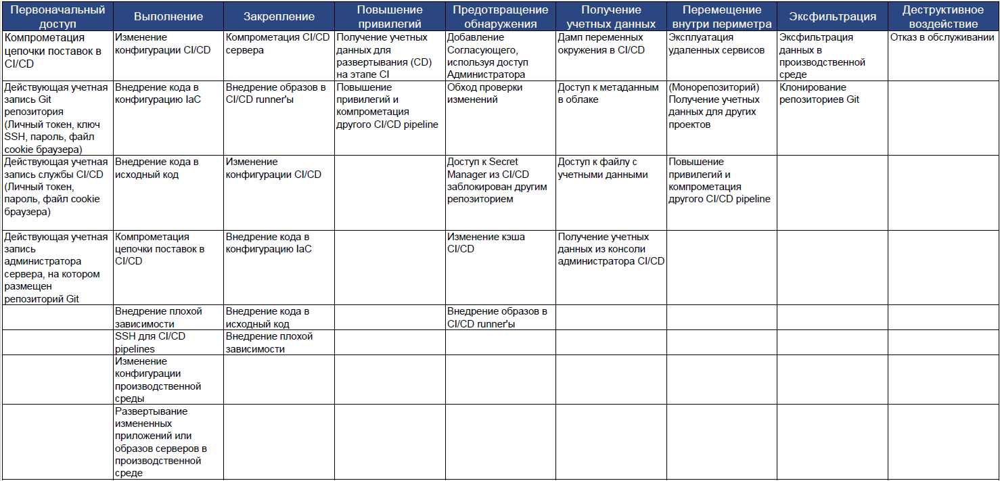

# Матрица угроз для CI/CD Pipeline

Это матрица типа ATT&CK, ориентированная на угрозы, характерные для CI/CD Pipeline.  
[MITRE ATT&CK®](https://attack.mitre.org/) это база знаний от тактиках и техниках, применяем злоумышленниками при атаках.  
Для описания угроз для CI/CD Pipeline, используется таже классификация, что и в MITRE ATT&CK.  

## Оглавление
- [Введение](#введение)
- [Матрица угроз](#матрица-угроз)
- [Компоненты CI/CD](#компоненты-cicd)
- [Техники и Способы предотвращения](#техники-и-способы-предотвращения)
    - [Первоначальный доступ](#первоначальный-доступ)
    - [Выполнение](#выполнение)
    - [Execution (Production)](#execution-production)
    - [Persistence](#persistence)
    - [Privilege Escalation](#privilege-escalation)
    - [Defense Evasion](#defense-evasion)
    - [Credential Access](#credential-access)
    - [Lateral Movement](#lateral-movement)
    - [Exfiltration](#exfiltration)
    - [Impact](#impact)
- [Common Question](#common-question)
    - [Supply-chain attacks are the only risk of CI/CD pipeline, correct?](#supply-chain-attacks-are-the-only-risk-of-cicd-pipeline-correct)

## Введение
Эта Матрица угроз была представлена в презентации “[Attacking and Securing CI/CD Pipeline](https://speakerdeck.com/rung/cd-pipeline)” на CODE BLUE 2021 Opentalks.  
Цель этой матрицы — поделиться знаниями о защите сред CI/CD с сообществом кибербезопасности.  
Эта матрица была создана Mercari Security Team и проверена Platform Team.   

## Матрица угроз

## Компоненты CI/CD

| Name                   | Tools                                                                                                                                               |
|------------------------|-----------------------------------------------------------------------------------------------------------------------------------------------------|
| Device                 | - Рабочая станция разработчика: Mac/Win/Cloud-based                                                                                                 |
| Git Repository Service | - GitHub, GitLab                                                                                                                                    |
| CI                     | - CI/CD Сервисы (такие, как: CircleCI, Cloud Build, Codebuild, GitHub Actions)                                                                      |
| CD                     | - CI/CD Сервисы (такие, как: CircleCI, Cloud Build, Codebuild, GitHub Actions)  - CD Сервисы (такие, как: Spinnaker, ArgoCD)                     |
| Secret Management      | - Сервисы управления секретами (такие, как: AWS Secret Manager, GCP Secret Manager, HashiCorp Vault)                                                |
| Production environment | - Облачные сервисы (такие, как: AWS, Google Cloud, Microsoft Azure)  - Другие ресурсы (такие, как: Container Registry, Linux Server, Kubernetes) |

## Техники и Способы предотвращения
### Первоначальный доступ

<table>
  <tr>
   <td>Техника
   </td>
   <td>Описание
   </td>
   <td>Способы предотвращения
   </td>
  </tr>
  <tr>
   <td>Компрометация цепочки поставок в CI/CD
   </td>
   <td>Атаки в цепочке поставок библиотек, инструментов, образов контейнеров в CI/CD Pipelines.
   </td>
   <td>
<ol>

<li>(CI, CD) Контроль и ограничение исходящих соединений через прокси-сервер и/или по IP-адресам

<li>(CI, CD) Аудит журналов

<li>(CI, CD) Мониторинг безопасности с использованием IDS/IPS и EDR

<li>(CI, CD) Проверка целостности всех инструментов

<li>(CI, CD) Запрет использования ненадежных библиотек и инструментов
</li>
</ol>
   </td>
  </tr>
  <tr>
   <td>Действующая учетная запись Git репозитория

(Личный токен, ключ SSH, пароль, файл cookie браузера)
   </td>
   <td>Используются учетные данные разработчика для доступа к службе репозитория Git \
(Личный токен, ключ SSH, файл cookie браузера или пароль для входа украдены)
   </td>
   <td>
<ol>

<li>(Device) Рассмотреть отдельно безопасность рабочих станций разработчиков

<li>(Git Repository) Сетевые ограничения (ACL, МСЭ)

<li>(Git Repository) Ограничение прав доступа каждого разработчика (например, запрет на запись, ограниченные разрешения на чтение)

<li>(CI, CD) Использование приложения GitHub и включение ограничений по IP-адресам
</li>
</ol>
   </td>
  </tr>
  <tr>
   <td>Действующая учетная запись службы CI/CD

(Личный токен, пароль, файл cookie браузера)
   </td>
   <td>Используются ключ SSH или токены для прямого доступа к серверам службы CI/CD
   </td>
   <td>
<ol>

<li>(CI, CD) Строгий контроль доступа к серверам CI/CD Pipeline

<li>(CI, CD) Усиление защиты серверов CI/CD Pipeline
</li>
</ol>
   </td>
  </tr>
  <tr>
   <td>Действующая учетная запись администратора сервера, на котором размещен репозиторий Git
   </td>
   <td>Используются ключ SSH и токены для доступа к серверу, на котором размещен репозиторий Git
   </td>
   <td>
<ol>

<li>(Git Repository) Строгий контроль доступа к серверу, на котором размещен репозиторий Git

<li>(Git Repository) Усиление защиты серверов репозитория Git
</li>
</ol>
   </td>
  </tr>
</table>

### Выполнение

<table>
  <tr>
   <td>Техника
   </td>
   <td>Описание
   </td>
   <td>Способы предотвращения
   </td>
  </tr>
  <tr>
   <td>Изменение конфигурации CI/CD
   </td>
   <td>Изменение конфигурации CI/CD в репозитории Git

(CircleCI: .circleci/config.yml, CodeBuild: buildspec.yml, CloudBuild: cloudbuild.yaml, GitHub Actions: .github/workflows/*.yaml)
   </td>
   <td>
<ol>

<li>(Git Repository) Разрешить отправку только подписанных коммитов

<li>(CI, CD) Запретить изменение конфигурации CI/CD без проверки (CI/CD не должен применять изменения ветки без проверки)

<li>(CI, CD) Добавьте подпись в конфигурацию CI/CD и её проверку

<li>(CI, CD) Контроль и ограничение исходящих соединений через прокси-сервер и/или по IP-адресам

<li>(CI, CD) Аудит журналов

<li>(CI, CD) Мониторинг безопасности с использованием IDS/IPS и EDR
</li>
</ol>
   </td>
  </tr>
  <tr>
   <td>Внедрение кода в конфигурацию IaC
   </td>
   <td>Например, Terraform позволяет выполнять код и включение файлов. Код выполняется на этапе CI (этап планирования)

Выполнение кода: Установка поставщика (поместите двоичный файл поставщика с расширением .tf), Используйте внешнего поставщика  
Включение файлов: функция из внешнего файла
   </td>
   <td>
<ol>

<li>(Git Repository) Разрешить отправку только подписанных коммитов

<li>(CI, CD) Ограничить опасный код с помощью Policy as Code

<li>(CI, CD) Ограничить ненадежных поставщиков

<li>(CI, CD) Контроль и ограничение исходящих соединений через прокси-сервер и/или по IP-адресам

<li>(CI, CD) Аудит журналов

<li>(CI, CD) Мониторинг безопасности с использованием IDS/IPS и EDR
</li>
</ol>
   </td>
  </tr>
  <tr>
   <td>Внедрение кода в исходный код
   </td>
   <td>Приложение выполняет тестовый код во время CI
   </td>
   <td>
<ol>

<li>(CI, CD) Ограничить опасный код с помощью Policy as Code

<li>(CI, CD) Контроль и ограничение исходящих соединений через прокси-сервер и/или по IP-адресам

<li>(CI, CD) Аудит журналов

<li>(CI, CD) Мониторинг безопасности с использованием IDS/IPS и EDR
</li>
</ol>
   </td>
  </tr>
  <tr>
   <td>Компрометация цепочки поставок в CI/CD
   </td>
   <td>(Повтор)
   </td>
   <td>
   </td>
  </tr>
  <tr>
   <td>Внедрение плохой зависимости
   </td>
   <td>Внедрение плохой зависимости
   </td>
   <td>
<ol>

<li>(CI, CD) Проверка кода с помощью SCA (анализ состава программного обеспечения)

<li>(CI, CD) Запрет использования ненадежных библиотек и инструментов

<li>(CI, CD) Контроль и ограничение исходящих соединений через прокси-сервер и/или по IP-адресам

<li>(CI, CD) Аудит журналов

<li>(CI, CD) Мониторинг безопасности с использованием IDS/IPS и EDR
</li>
</ol>
   </td>
  </tr>
  <tr>
   <td>SSH для CI/CD pipelines
   </td>
   <td>Подключение к серверам CI/CD pipeline через SSH или действительный токен
   </td>
   <td>
<ol>

<li>(CI, CD) Внедрить строгий контроль доступа к серверам CI/CD pipeline

<li>(CI, CD) Запретить доступ по SSH
</li>
</ol>
   </td>
  </tr>
</table>

### Выполнение (Производственная среда)

<table>
  <tr>
   <td>Техника
   </td>
   <td>Описание
   </td>
   <td>Способы предотвращения
   </td>
  </tr>
  <tr>
   <td>Изменение конфигурации производственной среды
   </td>
   <td>Изменение конфигурации производственной среды с помощью украденных учетных данных
   </td>
   <td>
<ol>

<li>(Secret Manager) Регулярно меняйте учетные данные или используйте только временные токены

<li>(Production environment) Сетевые ограничения для облачного API

<li>(Production environment) Включите ведение журналов аудита

<li>(Production environment) Мониторинг безопасности доступа к данным

<li>(Production environment) Применяйте принцип наименьших привилегий к выданным учетным данным

<li>(Production environment) Ограничение скорости
</li>
</ol>
   </td>
  </tr>
  <tr>
   <td>Развертывание измененных приложений или образов серверов в производственной среде
   </td>
   <td>Развертывание измененных приложений или образов серверов (например, образа контейнера, функции, образа виртуальной машины) в рабочей среде с помощью украденных учетных данных
   </td>
   <td>
<ol>

<li>(Secret Manager) Регулярно меняйте учетные данные или используйте только временные токены

<li>(Git Repository) Используйте одобрение (экспертная оценка) несколькими лицами

<li>(Production environment) Проверяйте подписи артефактов

<li>(Production environment) Сетевые ограничения для облачного API

<li>(Production environment) Включите ведение журналов аудита

<li>(Production environment) ониторинг безопасности развертывания

<li>(Production environment) Применяйте принцип наименьших привилегий к выданным учетным данным

<li>(Production environment) Ограничение скорости
</li>
</ol>
   </td>
  </tr>
</table>

### Persistence

<table>
  <tr>
   <td>Techniques
   </td>
   <td>Description
   </td>
   <td>Mitigation
   </td>
  </tr>
  <tr>
   <td>Compromise CI/CD Server
   </td>
   <td>Compromise CI/CD Server from pipeline
   </td>
   <td>
<ol>

<li>(CI, CD) Clean environment created on every pipeline run
</li>
</ol>
   </td>
  </tr>
  <tr>
   <td>Implant CI/CD runner images
   </td>
   <td>Implant container images for CI/CD with malicious code to establish persistence
   </td>
   <td>
<ol>

<li>Use signed/trusted CI runners only

<li>Implement strict access controls to container registry

<li>(CI, CD) Audit Logging of activities
</li>
</ol>
   </td>
  </tr>
  <tr>
   <td>(Modify CI/CD Configuration)
   </td>
   <td>(Repeated)
   </td>
   <td>
   </td>
  </tr>
  <tr>
   <td>(Inject code to IaC configuration)
   </td>
   <td>(Repeated)
   </td>
   <td>
   </td>
  </tr>
  <tr>
   <td>(Inject code to source code)
   </td>
   <td>(Repeated)
   </td>
   <td>
   </td>
  </tr>
  <tr>
   <td>(Inject bad dependency)
   </td>
   <td>(Repeated)
   </td>
   <td>
   </td>
  </tr>
</table>

### Privilege Escalation

<table>
  <tr>
   <td>Techniques
   </td>
   <td>Description
   </td>
   <td>Mitigation
   </td>
  </tr>
  <tr>
   <td>Get credential for Deployment(CD) on CI stage
   </td>
   <td>Get high privilege credential in CI stage (not CD)
   </td>
   <td>
<ol>

<li>(CI, CD) Limit the scope of credentials in each step.

<li>(CI) Always enforce Least Privilege. CI(not CD) must not have credentials for deployment

<li>(CI, CD) Use different Identities between CI and CD

<li>(CI, CD) Maintain strong isolation between CI and CD
</li>
</ol>
   </td>
  </tr>
  <tr>
   <td>Privileged Escalation and compromise other CI/CD pipeline
   </td>
   <td>Privilege Escalation from CI/CD Environment to other components
   </td>
   <td>
<ol>

<li>(CI, CD) Hardening of CI/CD pipeline servers 

<li>(CI, CD) Isolate CI/CD pipeline from other systems.
</li>
</ol>
   </td>
  </tr>
</table>

### Defense Evasion

<table>
  <tr>
   <td>Techniques
   </td>
   <td>Description
   </td>
   <td>Mitigation
   </td>
  </tr>
  <tr>
   <td>Add Approver using Admin permission
   </td>
   <td>Change Approver using Git Repository Service Admin permission
   </td>
   <td>
<ol>

<li>(Git Repository) Limit admin users

<li>(Git Repository) Require multi-party approval(peer review)
</li>
</ol>
   </td>
  </tr>
  <tr>
   <td>Bypass Review
   </td>
   <td>Bypass Peer Review of Git Repository
   </td>
   <td>
<ol>

<li>(Git Repository) Restrict repository admin from pushing to main branch without a review

<li>(CD) Require additional approval from reviewer to kick CD
</li>
</ol>
   </td>
  </tr>
  <tr>
   <td>Access to Secret Manager from CI/CD kicked by different repository
   </td>
   <td>Use a CI/CD system in a different repository to leverage stolen credentials to access secret manager
   </td>
   <td>
<ol>

<li>(Secret Manager) Restrict and separate access from different workloads
</li>
</ol>
   </td>
  </tr>
  <tr>
   <td>Modify Caches of CI/CD
   </td>
   <td>Implant bad code to caches of CI/CD pipeline
   </td>
   <td>
<ol>

<li>(CI, CD) Clean environment on every pipeline run
</li>
</ol>
   </td>
  </tr>
  <tr>
   <td>Implant CI/CD runner images
   </td>
   <td>(Repeated)
   </td>
   <td>
   </td>
  </tr>
</table>

### Credential Access

<table>
  <tr>
   <td>Techniques
   </td>
   <td>Description
   </td>
   <td>Mitigation
   </td>
  </tr>
  <tr>
   <td>Dumping Env Variables in CI/CD
   </td>
   <td>Dump Environment Variables in CI/CD
   </td>
   <td>
<ol>

<li>(CI, CD) Don’t use environment variables for storing credentials

<li>(Secret Manager) Use secret manager which has network restriction

<li>(Secret Manager) Enable Audit Logging

<li>(Secret Manager) Security Monitoring to detect malicious activity

<li>(Secret Manager) Rotate credentials regularly or issue temporary tokens only

<li>(CI, CD) Enable Audit Logging

<li>(CI, CD) Security Monitoring using IDS/IPS, and EDR
</li>
</ol>
   </td>
  </tr>
  <tr>
   <td>Access to Cloud Metadata
   </td>
   <td>Access to Cloud Metadata to get access token of Cloud resources
   </td>
   <td>
<ol>

<li>(CI, CD) Restrict metadata access from suspicious processes

<li>(Secret Manager) Use secret manager which has network restriction

<li>(Secret Manager) Enable Audit Logging

<li>(Secret Manager) Security Monitoring to detect malicious activity

<li>(Secret Manager) Rotate credentials regularly or issue temporary tokens only

<li>(CI, CD) Enable Audit Logging

<li>(CI, CD) Security Monitoring using IDS/IPS, and EDR
</li>
</ol>
   </td>
  </tr>
  <tr>
   <td>Read credentials file
   </td>
   <td>Read credentials file mounted in CI/CD pipeline
   </td>
   <td>
<ol>

<li>(CI, CD) Disable or mask contents of files in results of CI/CD

<li>(Secret Manager) Use secret manager which has network restriction

<li>(Secret Manager) Enable Audit Logging

<li>(Secret Manager) Security Monitoring to detect malicious activity

<li>(Secret Manager) Rotate credentials regularly or issue temporary tokens only

<li>(CI, CD) Enable Audit Logging

<li>(CI, CD) Security Monitoring using IDS/IPS, and EDR
</li>
</ol>
   </td>
  </tr>
  <tr>
   <td>Get credential from CI/CD Admin Console
   </td>
   <td>See credential from CI/CD admin console
   </td>
   <td>
<ol>

<li>(CI, CD) Doesn’t use CI/CD services that expose credentials from the system console
</li>
</ol>
   </td>
  </tr>
</table>

### Lateral Movement

<table>
  <tr>
   <td>Techniques
   </td>
   <td>Description
   </td>
   <td>Mitigation
   </td>
  </tr>
  <tr>
   <td>Exploitation of Remote Services
   </td>
   <td>Exploit services from CI/CD Pipeline
   </td>
   <td>
<ol>

<li>(CI, CD) Isolate CI/CD pipeline systems from other services
</li>
</ol>
   </td>
  </tr>
  <tr>
   <td>(Monorepo) Get credential of different folder's context
   </td>
   <td>In monorepo architecture of Git Repository, there are many approvers.

Need to set access controls carefully
   </td>
   <td>
<ol>

<li>(Git Repository) Set approver for each folder

<li>(CI, CD, Secret Manager) Avoid sharing CI/CD environment and credentials between different folders. 

<li>(CI, CD) should be isolated by environment folder or context
</li>
</ol>
   </td>
  </tr>
  <tr>
   <td>Privileged Escalation and compromise other CI/CD pipeline

(Repeated)
   </td>
   <td>
   </td>
   <td>
   </td>
  </tr>
</table>

### Exfiltration

<table>
  <tr>
   <td>Techniques
   </td>
   <td>Description
   </td>
   <td>Mitigation
   </td>
  </tr>
  <tr>
   <td>Exfiltrate data in Production environment
   </td>
   <td>Exfiltrate data in Production environment via stolen credentials
   </td>
   <td>
<ol>

<li>(CI/CD) Doesn’t put data access credential in CI/CD

<li>(Production environment) Network Restriction to Cloud API

<li>(Production environment) Enable Audit Logging

<li>(Production environment) Security Monitoring of data access

<li>(Production environment) Enforce principle of least privilege to issued credentials

<li>(Production environment) Rate limiting
</li>
</ol>
   </td>
  </tr>
  <tr>
   <td>Clone Git Repositories
   </td>
   <td>Exfiltrate data from Git Repositories
   </td>
   <td>
<ol>

<li>(Git Repository) Network Restriction

<li>(Git Repository) Use temporary tokens instead of long life static tokens

<li>(Git Repository) Limit access permission of each developer (e.g. no write permission, limited read permission)

<li>(Git Repository) Enable Audit Logging

<li>(Git Repository) Security Monitoring of data access

<li>(Git Repository) Rate limiting
</li>
</ol>
   </td>
  </tr>
</table>

### Impact

<table>
  <tr>
   <td>Techniques
   </td>
   <td>Description
   </td>
   <td>Mitigation
   </td>
  </tr>
  <tr>
   <td>Denial of Services
   </td>
   <td>Denial of Services of CI/CD pipeline
   </td>
   <td>
<ol>

<li>(CI, CD) Scalable Infrastructure
</li>
</ol>
   </td>
  </tr>
</table>

  
## Common Question
### Supply-chain attacks are the only risk of CI/CD pipeline, correct?

Supply-chain attacks are one of the most serious risks. But it is not the only risk for CI/CD Pipelines. The entire attack surface need to be considered. You can check my slide: “[Attacking and Securing CI/CD Pipeline](https://speakerdeck.com/rung/cd-pipeline)” to know risks of CI/CD pipeline

